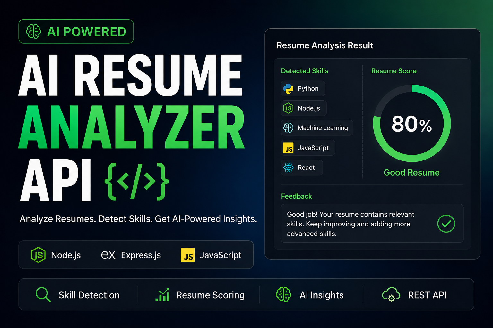

# AI Resume Analyzer API
https://ai-resume-analyzer-api-1v76.onrender.com/

A backend API that analyzes resume text and detects technical skills.

## Features
- Detects skills from resume text
- Calculates resume score
- Provides feedback
- REST API built with Node.js and Express

## Tech Stack
- Node.js
- Express.js
- JavaScript

## API Endpoint

POST /analyze

### Example Request

{
  "resumeText": "I know Python and Machine Learning"
}

### Example Response

{
  "detectedSkills": ["Python", "Machine Learning"],
  "score": 40,
  "feedback": "Need More Skills"
}
